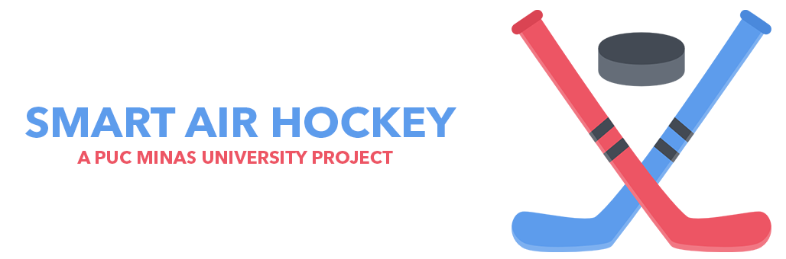

# PUC Minas University - Air Hockey

  

  &nbsp;
  
Membros

  <table>
    <tr>
      <td align="center">
        <a href="https://github.com/RafaelBrandaoBastos" title="GitHub de Rafael Brandão">
           
          <b>Rafael Brandão</b>
        </a>
      </td>
      <td align="center">
        <a href="https://github.com/Awakened-Redstone" title="GitHub de Marcos Dias">
           
          <b>Marcos Dias</b>
        </a>
      </td>
      <td align="center">
        <a href="https://github.com/MattosPedro" title="GitHub de Pedro Lucas">
           
          <b>Pedro Lucas</b>
        </a>
      </td>
      <td align="center">
         
        <b>Rodrigo Rocha</b>
      </td>
    </tr>
  </table>

  
Colaboradores

  <table>
    <tr>
      <td align="center">
        <a href="https://www.linkedin.com/in/pedro-carneiro-rabetim-11156222a/" title="LinkedIn de Pedro Carneiro">
           
          <b>Pedro Carneiro</b>
        </a>
      </td>
      <td align="center">
        <a href="https://www.linkedin.com/in/mario-buratto-047b3630/" title="LinkedIn de Mario Buratto">
           
          <b>Prof Mario B.</b>
        </a>
      </td>
      <td align="center">
        <a href="https://www.linkedin.com/in/ilorivero/" title="LinkedIn de Ilo Ribeiro">
           
          <b>Prof Ilo Ribeiro</b>
        </a>
      </td>
    </tr>
  </table>

# 3D Prints

# Frontend

# Backend
