# PUC Minas University - Air Hockey

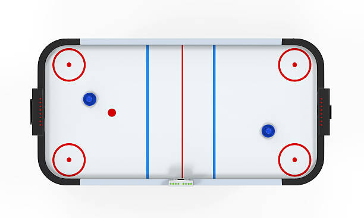

  # Air Hockey Team
  
  <table>
    <tr>
      <td align="center">
        <a href="https://github.com/RafaelBrandaoBastos" title="GitHub de Rafael Brandão">
          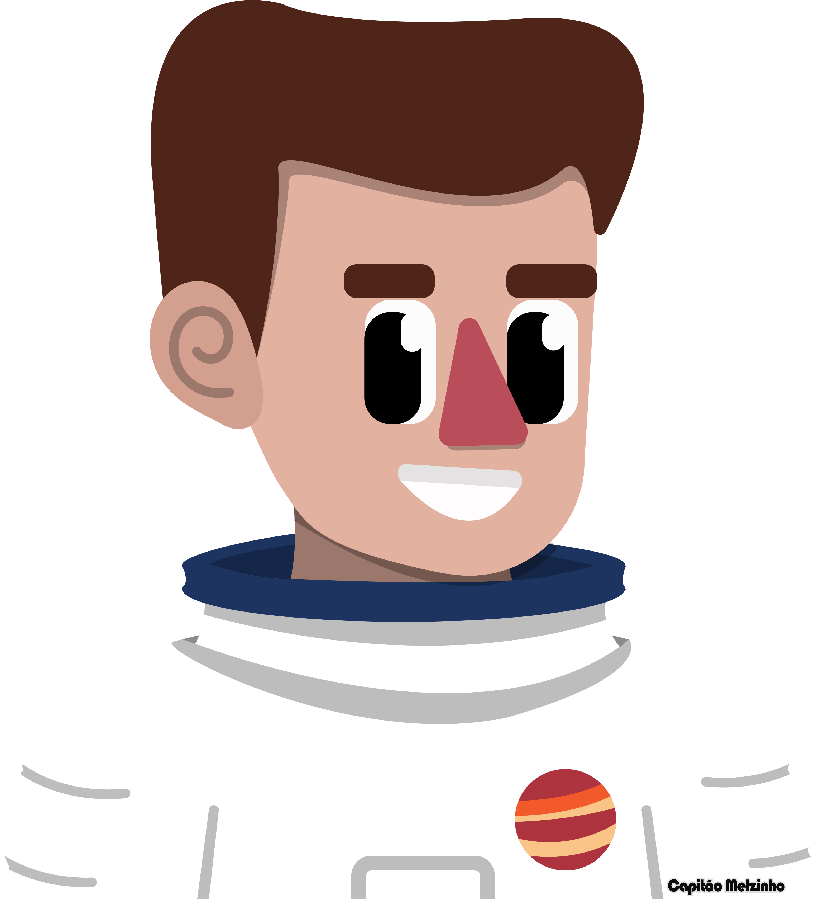 
          <b>Rafael Brandão</b>
        </a>
      </td>
      <td align="center">
        <a href="https://github.com/yrlanrteixeira" title="GitHub de Yrlan Teixeira">
          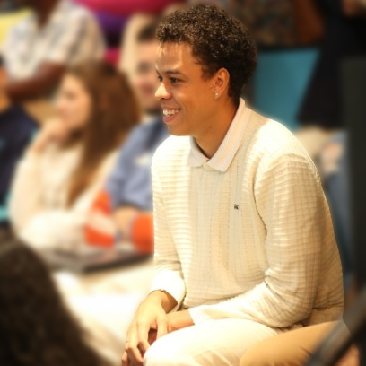 
          <b>Yrlan Teixeira</b>
        </a>
      </td>
      <td align="center">
        <a href="https://github.com/scrow-rgb" title="GitHub de Caio">
           
          <b>Caio</b>
        </a>
      </td>
      <td align="center">
        <a href="https://github.com/RodrigoRocha2810" title="GitHub de Rodrigo">
           
          <b>Rodrigo Rocha</b>
        </a>
      </td>
    </tr>
  </table>
  <table>
    <tr>
      <td align="center">
        
3D Supervisor

        <a href="https://www.linkedin.com/in/bernardo-bydo-miranda/" title="LinkedIn de Bernardo">
          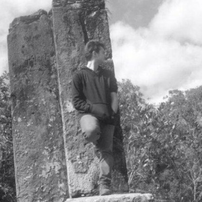 
          <b>Bernardo Miranda</b>
        </a>
      </td>
      <td align="center">
        
Gen. Supervisor

        <a href="https://www.linkedin.com/in/mario-buratto-047b3630/" title="LinkedIn de Mario Buratto">
           
          <b>Prof Mario B.</b>
        </a>
      </td>
    </tr>
  </table>

# Results

  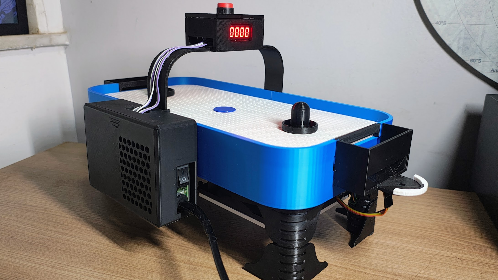
  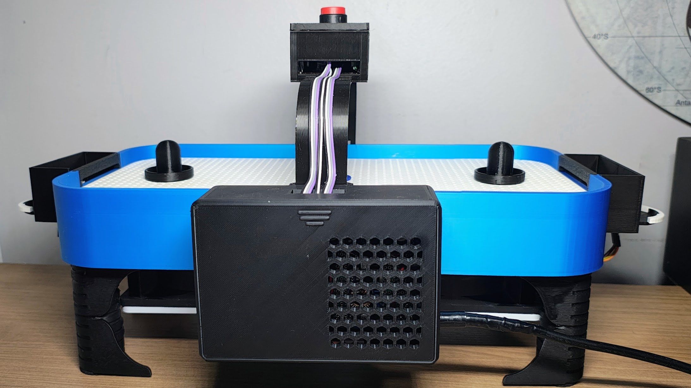

  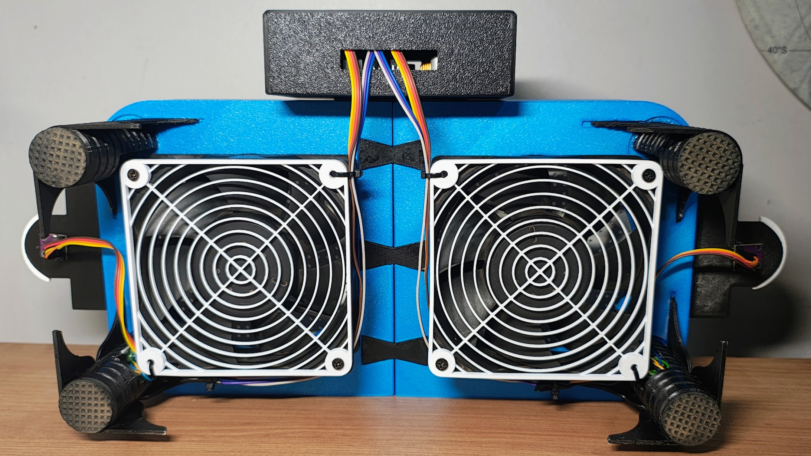
  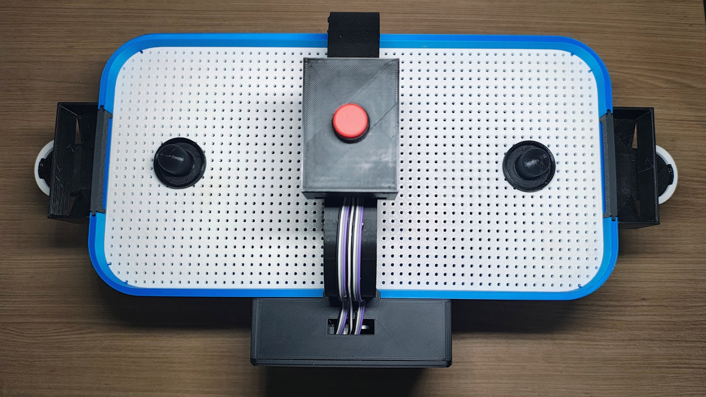

  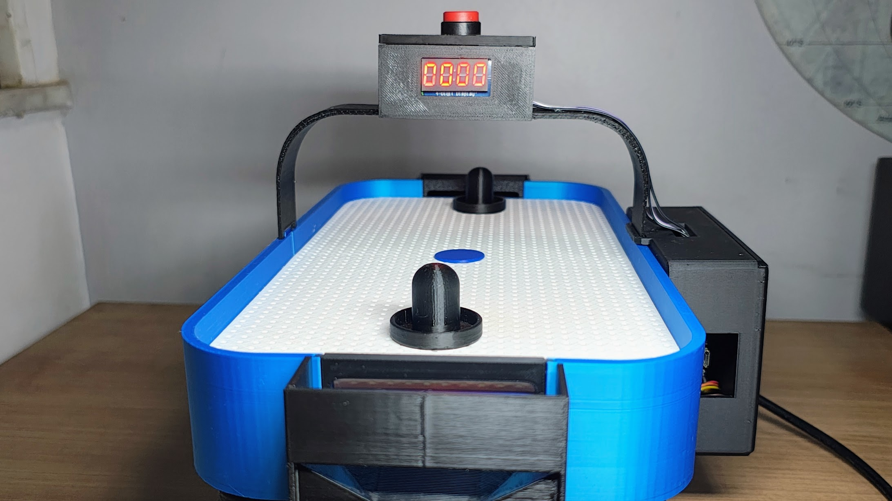
  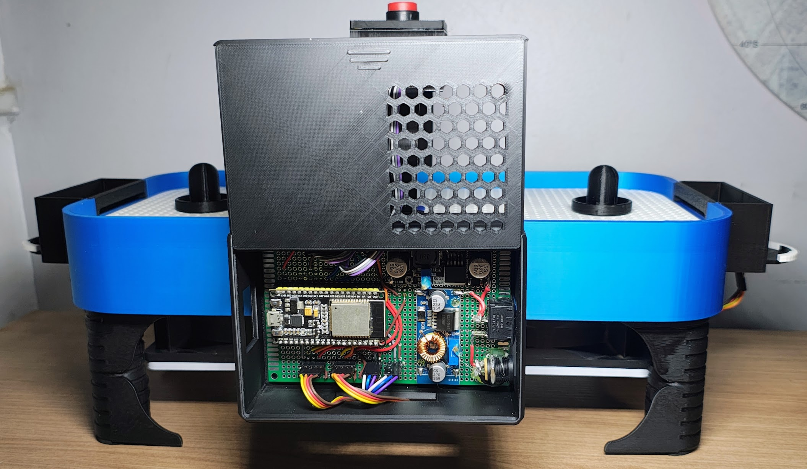

# 3D Prints
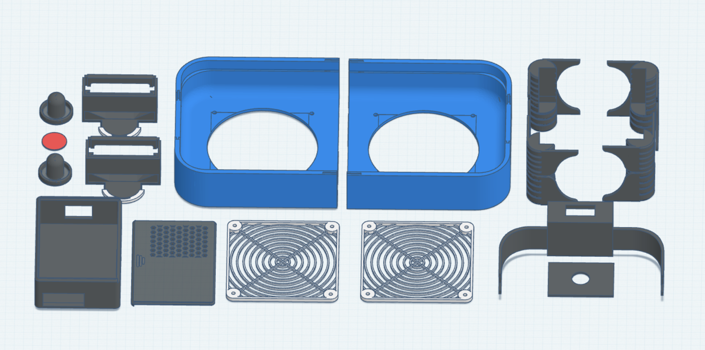

## Modified version of:
https://makerworld.com/pt/models/783768-miniature-desktop-airhockey-table-a1-mini-no-ams?from=search#profileId-721221
